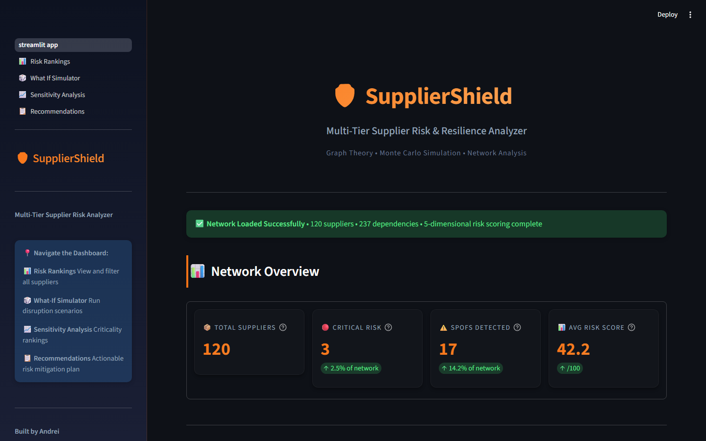

# 🛡️ SupplierShield

**Multi-tier supply chain risk analyzer — maps hidden vulnerabilities before they become million-euro disruptions.**

[](https://www.python.org/downloads/)
[](https://opensource.org/licenses/MIT)
[](tests/)

> *What if the safest supplier in your network is actually your biggest risk?*

---

## 📸 Screenshot


*Dashboard screenshot coming soon.*

---

## 📖 The Story

Most companies know their Tier-1 suppliers. Almost none have visibility into Tier-2 or Tier-3 — the component makers and raw material providers buried deep in the chain. When a flood shuts down a factory in Malaysia or export restrictions hit DR Congo, procurement teams discover too late that their entire production depended on a single supplier they'd never heard of.

SupplierShield was built to catch exactly that. It maps **120 suppliers across 3 tiers**, scores each one across **5 risk dimensions**, then does something most tools don't: it propagates risk upward through the network. A Swiss supplier scored **16.4** — low risk, stable country, excellent logistics. But it depended entirely on a Tier-3 supplier in DR Congo with a risk score of **75.0**. After propagation, its true risk jumped to **39.9**. A **143% increase** that traditional analysis completely misses.

That's one supplier. SupplierShield found **17 single points of failure**, ran **Monte Carlo simulations** to quantify the financial damage, and generated **59 prioritized recommendations** — all surfaced through an interactive dashboard where you can simulate disruptions in real time.

---

## 🔍 What It Found

| Metric | Value | Why It Matters |
|---|---|---|
| **Single Points of Failure** | **17** detected, one with a **72x impact multiplier** | A €0.77M contract exposing €55.4M in downstream value |
| **Hidden Risk Increases** | **47 suppliers** re-scored after propagation | Tier-2 suppliers saw the largest average increase (+5.59 points) |
| **High-Priority Contract Value** | **€50.44M** requiring action within 30-60 days | 19 recommendations at HIGH severity across 40 suppliers |
| **Monte Carlo Worst Case** | **€22.98M** revenue impact (5,000 iterations) | P95 gives procurement a concrete contingency budget number |
| **Pareto Concentration** | **21 suppliers (17.5%)** drive **50%** of total risk | Focus mitigation on the critical few, not the trivial many |

---

## 📊 How Risk Scoring Works

Every supplier receives a **composite risk score (0-100)** based on five weighted dimensions:

| Dimension | Weight | Source |
|---|---|---|
| **Geopolitical Risk** | 30% | Country political stability index |
| **Natural Disaster Risk** | 20% | Country disaster frequency index |
| **Financial Risk** | 20% | Inverse of supplier financial health score |
| **Logistics Risk** | 15% | Inverse of country logistics performance |
| **Concentration Risk** | 15% | Number of alternative suppliers available |

But scoring in isolation isn't enough. SupplierShield **propagates risk upward** through the dependency graph using a bottom-up cascade from Tier-3 to Tier-1:

```
propagated_risk = max(own_risk, own_risk × 0.6 + upstream_avg × 0.4)
```

This means a "safe" Tier-1 supplier gets its score increased if its Tier-2 or Tier-3 dependencies are risky — the `max()` ensures risk only ever increases, never decreases. The **0.6/0.4 split** keeps a supplier's own risk dominant while letting dangerous upstream dependencies pull the score up. The result: **47 suppliers** had their scores increased after propagation, with Tier-2 seeing the largest average jump (**+5.59 points**) due to direct exposure to risky Tier-3 raw material providers.

> **Key insight:** S047 (Switzerland) looked completely safe at **16.4** — but its sole dependency on S009 (DR Congo, **75.0**) pushed its propagated risk to **39.9**. Without propagation, this supplier would never appear on a risk report.

---

## 🎯 What This Means for Procurement

The **17 SPOFs** need backup supplier qualification — **10** are high-priority requiring action within **0-30 days**, all concentrated in high-risk regions. The **72x impact multiplier** on S016 demonstrates why contract value alone is a misleading risk indicator: a €0.77M Tier-3 supplier feeds 4 Tier-2 nodes, which feed 16 Tier-1 nodes, putting **€55.4M** at risk through cascading failure.

Regional concentration is the most urgent structural weakness: **9 of 10 critical SPOFs** are in **DR Congo**. Geographic diversification isn't optional — it's the single highest-leverage mitigation. Monte Carlo **P95 values** (€18.41M for the most critical SPOF) give procurement a concrete number to budget for contingency reserves, turning probabilistic risk into actionable financial planning.

---

## ⚡ How It Works

`CSV → NetworkX Graph → Risk Scoring → Propagation → SPOF Detection → Monte Carlo Simulation → Streamlit Dashboard`

```
src/
├── data/                # Generate & validate 120 suppliers, 237 dependencies, 14 countries
├── network/             # Build directed acyclic graph, validate tier flow (T3 → T2 → T1)
├── risk/                # 5-dimension scoring, bottom-up propagation, SPOF detection
├── simulation/          # Monte Carlo disruption sim, sensitivity & criticality ranking
├── impact/              # BOM tracer — map supplier failures to product revenue-at-risk
└── recommendations/     # Rule-based engine — 59 prioritized actions with timelines

app/                     # Streamlit dashboard — 5 pages, dark theme, interactive charts
scripts/                 # CLI entry points for each pipeline stage
tests/                   # 29 pytest unit tests
data/raw/                # Generated CSVs (suppliers, dependencies, country_risk, product_bom)
```

---

## 🧪 Tech Stack

| Python | pandas | NetworkX | NumPy | Plotly | Streamlit | pytest |
|---|---|---|---|---|---|---|
| Core language | Data manipulation | Graph analysis | Numerical computation | Interactive charts | Dashboard UI | Testing framework |

---

## 🗺️ Roadmap

- ✅ **Stage 1** — Python analytics engine + Streamlit dashboard *(current)*
- 🔲 **Stage 2** — FastAPI REST API + React web application
- 🔲 **Stage 3** — React Native mobile app

---

## 🚀 Quick Start

> Requires **Python 3.10+**. Use a virtual environment.

```bash
git clone https://github.com/andrei-motora/suppliershield.git
cd suppliershield
pip install -r requirements.txt
python scripts/generate_data.py
streamlit run app/streamlit_app.py
```

---

## 👨‍💻 Author

**Andrei** — International Business, HBO University of Applied Sciences, Venlo.

I build data-driven tools that turn supply chain complexity into actionable risk intelligence.

[GitHub](https://github.com/andrei-motora) · LinkedIn

---

## 📄 License

MIT
